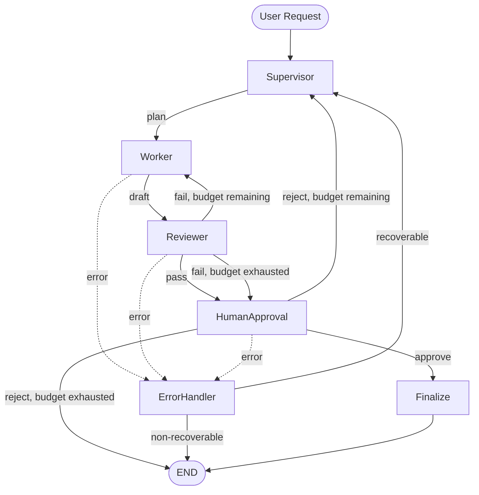

# LangGraph Multi-Agent Workflow Showcase

A LangGraph showcase for stateful multi-agent orchestration with review loops, quantified scoring, error handling, human approval, and resumable execution.

## Why This Project

This repository is intentionally narrow. It does not try to be a general multi-agent platform. The point is to show a clean, interview-ready workflow that demonstrates:

- stateful orchestration
- supervisor / worker / reviewer role separation
- quantified review scoring and revision loops
- human-in-the-loop approval with rejection feedback
- checkpoint persistence and resume
- explicit failure handling and terminal states

## Architecture



More detail is in [docs/architecture.md](docs/architecture.md) and [docs/state_machine.md](docs/state_machine.md).

## State Schema

The workflow uses one core state object in [app/state.py](app/state.py):

- `task_id`
- `user_request`
- `plan`
- `draft`
- `review_feedback`
- `review_score`
- `final_output`
- `status`
- `revision_count`
- `max_revisions`
- `human_decision`
- `human_rejection_reason`
- `execution_log`
- `error_info`

`execution_log` stores `{node, input_summary, output_summary, duration_ms}` for each completed node so the run stays inspectable after retries, pauses, and resume.

## Project Structure

```text
langgraph-multi-agent-workflow-showcase/
|-- README.md
|-- requirements.txt
|-- .env.example
|-- main.py
|-- demo_inputs/
|   |-- normal_task.txt
|   |-- revision_task.txt
|   |-- human_review_task.txt
|   |-- error_recovery_task.txt
|   |-- financial_report_task.txt
|   `-- compliance_review_task.txt
|-- app/
|   |-- graph.py
|   |-- state.py
|   |-- config.py
|   |-- prompts.py
|   |-- checkpoint.py
|   |-- routing.py
|   |-- models.py
|   |-- types.py
|   `-- utils.py
|-- app/nodes/
|   |-- supervisor.py
|   |-- worker.py
|   |-- reviewer.py
|   |-- human_approval.py
|   |-- error_handler.py
|   `-- finalize.py
|-- app/tests/
|   |-- test_routing.py
|   |-- test_review_loop.py
|   `-- test_state_transitions.py
`-- docs/
    |-- architecture.md
    |-- state_machine.md
    `-- sample_run.md
```

## Key Features

- LangGraph stateful workflow using supervisor / worker / reviewer / human approval / error handler roles
- Quantified reviewer scoring with a configurable pass threshold
- Revision guardrails through `revision_count` and `max_revisions`
- Human approval interrupt with rejection reason carried back into planning
- Recoverable vs non-recoverable error handling
- SQLite checkpoint persistence with resumable execution
- Per-node execution logging for observability and debugging

## Installation

```bash
python3 -m venv .venv
source .venv/bin/activate
pip install -r requirements.txt
cp .env.example .env
```

Set `.env` to any OpenAI-compatible endpoint. The LLM integration is implemented with `langchain_openai.ChatOpenAI`.

## How To Run

Start a new workflow:

```bash
python3 main.py --input demo_inputs/normal_task.txt
python3 main.py --input demo_inputs/revision_task.txt
python3 main.py --input demo_inputs/human_review_task.txt
```

Domain-specific demos (financial services scenarios):

```bash
python3 main.py --input demo_inputs/financial_report_task.txt
python3 main.py --input demo_inputs/compliance_review_task.txt
```

Resume a checkpointed run:

```bash
python3 main.py --resume <thread_id>
python3 main.py --resume <thread_id> --decision approve
python3 main.py --resume <thread_id> --decision reject --reason "Direction is too generic"
```

Error recovery demo:

```bash
python3 main.py --request "SIMULATE_WORKER_TIMEOUT Create a launch checklist for a B2B analytics feature."
```

The first pause point is `human_approval`. The CLI prints the thread id and the interrupt payload, then waits for a later `--resume`.

## Tests

The unit tests focus on routing, revision-loop behavior, and state transitions. They monkeypatch the LLM calls so they can run without live API access.

```bash
python3 -m pytest app/tests
```

## Sample Execution Paths

The docs include four representative runs:

1. normal pass
2. reviewer fail then revision
3. human reject then re-plan
4. worker error then error recovery

See [docs/sample_run.md](docs/sample_run.md).

## What This Demonstrates

- orchestration thinking
- state machine design
- explicit reliability guardrails
- human oversight in the loop
- resumable execution with persistence
